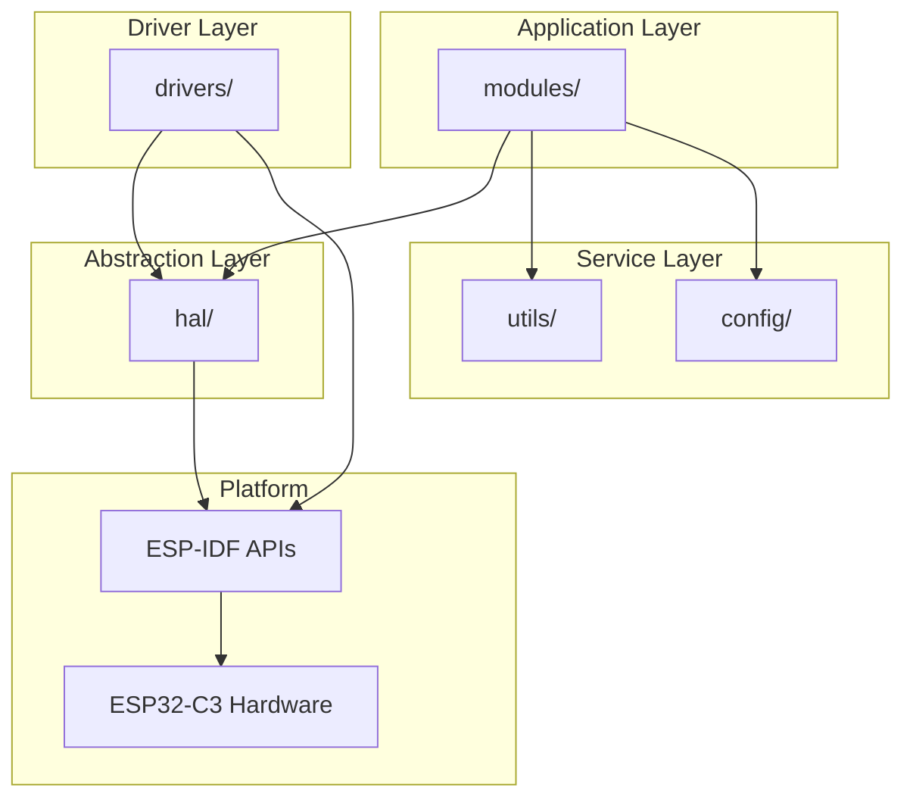
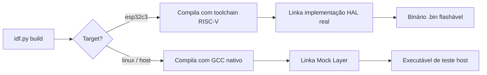
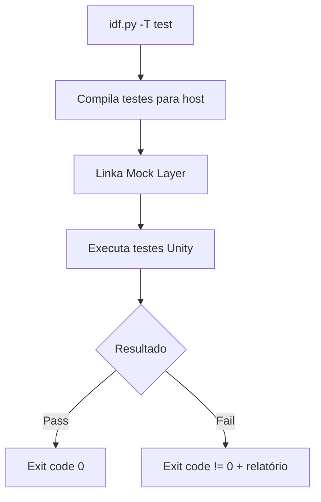

# Design Document — Project Foundation

## Overview

Este documento detalha o design técnico da infraestrutura de desenvolvimento do projeto Sóliton. O objetivo é estabelecer toda a base necessária antes da implementação dos módulos funcionais (Radar, Áudio, Energia, BLE): sistema de build ESP-IDF, camada HAL, arquitetura de drivers, framework de testes, pipeline CI, estrutura de diretórios e regras de dependência entre camadas.

A fundação do projeto prioriza:
- **Reprodutibilidade**: qualquer desenvolvedor compila o projeto em ≤3 comandos
- **Testabilidade**: código testável em host (x86) sem hardware físico
- **Modularidade**: componentes isolados com interfaces bem definidas
- **Qualidade**: análise estática e CI automatizado detectam erros antes do merge

### Decisões Técnicas Chave

| Decisão | Escolha | Justificativa |
|---------|---------|---------------|
| MCU | ESP32-C3 (RISC-V) | BLE integrado, baixo custo, suporte ESP-IDF maduro |
| Build System | ESP-IDF v5.x + CMake | Framework oficial Espressif, componentes modulares |
| Linguagem | C (drivers/HAL) + C++ limitado (utils) | Controle de memória, sem overhead de runtime |
| Testes | Unity + CMock | Padrão ESP-IDF, geração automática de mocks |
| CI | GitHub Actions + Docker espressif/idf | Imagem oficial, cachê de toolchain |
| Análise Estática | clang-tidy + clang-format | Integração nativa com CMake, rules configuráveis |
| Emulação | Wokwi (primário) + Mock Layer (host) | Wokwi tem suporte ESP32-C3 com periféricos |

---

## Architecture

### Diagrama de Camadas



### Regras de Dependência

```
┌─────────────────────────────────────────────────────────────────┐
│ CAMADA          │ PODE DEPENDER DE         │ NÃO PODE DEPENDER  │
├─────────────────┼──────────────────────────┼────────────────────┤
│ modules/        │ hal/, utils/, config/    │ drivers/            │
│ drivers/        │ hal/, ESP-IDF APIs       │ modules/, utils/,   │
│                 │                          │ outros drivers      │
│ hal/            │ tipos C stdlib, ESP-IDF  │ drivers/, modules/  │
│ utils/          │ tipos C stdlib           │ hal/, drivers/,     │
│                 │                          │ modules/            │
│ config/         │ tipos C stdlib           │ tudo (só dados)     │
└─────────────────────────────────────────────────────────────────┘
```

### Fluxo de Build



### Fluxo de Testes



---

## Components and Interfaces

### 1. HAL — Hardware Abstraction Layer

A HAL define interfaces puras (headers) para cada periférico, com duas implementações selecionáveis via build flag.

#### Interface: `hal/include/hal_i2c.h`

```c
#ifndef SOLITON_HAL_I2C_H
#define SOLITON_HAL_I2C_H

#include "hal_error.h"
#include <stdint.h>
#include <stddef.h>

typedef struct {
    uint8_t port;       /* I2C port number (0 or 1) */
    uint8_t sda_pin;
    uint8_t scl_pin;
    uint32_t freq_hz;   /* Clock frequency in Hz */
} hal_i2c_config_t;

/**
 * @brief Inicializa o barramento I2C com a configuração fornecida.
 * @return HAL_OK em sucesso, código de erro caso contrário.
 */
hal_err_t hal_i2c_init(const hal_i2c_config_t *config);

/**
 * @brief Escreve dados no dispositivo I2C no endereço especificado.
 */
hal_err_t hal_i2c_write(uint8_t port, uint8_t dev_addr, 
                         const uint8_t *data, size_t len);

/**
 * @brief Lê dados do dispositivo I2C no endereço especificado.
 */
hal_err_t hal_i2c_read(uint8_t port, uint8_t dev_addr,
                        uint8_t *buffer, size_t len);

/**
 * @brief De-inicializa o barramento I2C e libera recursos.
 */
hal_err_t hal_i2c_deinit(uint8_t port);

#endif /* SOLITON_HAL_I2C_H */
```

#### Interface: `hal/include/hal_pwm.h`

```c
#ifndef SOLITON_HAL_PWM_H
#define SOLITON_HAL_PWM_H

#include "hal_error.h"
#include <stdint.h>

typedef struct {
    uint8_t channel;
    uint8_t gpio_pin;
    uint32_t freq_hz;
    uint8_t resolution_bits;
} hal_pwm_config_t;

hal_err_t hal_pwm_init(const hal_pwm_config_t *config);
hal_err_t hal_pwm_set_duty(uint8_t channel, uint8_t duty_percent);
hal_err_t hal_pwm_deinit(uint8_t channel);

#endif /* SOLITON_HAL_PWM_H */
```

#### Interface: `hal/include/hal_uart.h`

```c
#ifndef SOLITON_HAL_UART_H
#define SOLITON_HAL_UART_H

#include "hal_error.h"
#include <stdint.h>
#include <stddef.h>

typedef struct {
    uint8_t port;
    uint8_t tx_pin;
    uint8_t rx_pin;
    uint32_t baud_rate;
} hal_uart_config_t;

hal_err_t hal_uart_init(const hal_uart_config_t *config);
hal_err_t hal_uart_write(uint8_t port, const uint8_t *data, size_t len);
hal_err_t hal_uart_read(uint8_t port, uint8_t *buffer, size_t len, 
                         uint32_t timeout_ms);
hal_err_t hal_uart_deinit(uint8_t port);

#endif /* SOLITON_HAL_UART_H */
```

#### Interface: `hal/include/hal_adc.h`

```c
#ifndef SOLITON_HAL_ADC_H
#define SOLITON_HAL_ADC_H

#include "hal_error.h"
#include <stdint.h>

typedef struct {
    uint8_t channel;
    uint8_t atten;      /* Atenuação ADC */
    uint8_t width_bits; /* Resolução em bits */
} hal_adc_config_t;

hal_err_t hal_adc_init(const hal_adc_config_t *config);
hal_err_t hal_adc_read_raw(uint8_t channel, uint32_t *raw_value);
hal_err_t hal_adc_read_mv(uint8_t channel, uint32_t *voltage_mv);
hal_err_t hal_adc_deinit(uint8_t channel);

#endif /* SOLITON_HAL_ADC_H */
```

#### Interface: `hal/include/hal_gpio.h`

```c
#ifndef SOLITON_HAL_GPIO_H
#define SOLITON_HAL_GPIO_H

#include "hal_error.h"
#include <stdint.h>

typedef enum {
    HAL_GPIO_MODE_INPUT,
    HAL_GPIO_MODE_OUTPUT,
    HAL_GPIO_MODE_INPUT_OUTPUT
} hal_gpio_mode_t;

typedef struct {
    uint8_t pin;
    hal_gpio_mode_t mode;
    uint8_t pull_up;    /* 1 = enable, 0 = disable */
    uint8_t pull_down;  /* 1 = enable, 0 = disable */
} hal_gpio_config_t;

hal_err_t hal_gpio_init(const hal_gpio_config_t *config);
hal_err_t hal_gpio_set_level(uint8_t pin, uint8_t level);
hal_err_t hal_gpio_get_level(uint8_t pin, uint8_t *level);
hal_err_t hal_gpio_deinit(uint8_t pin);

#endif /* SOLITON_HAL_GPIO_H */
```

#### Códigos de Erro: `hal/include/hal_error.h`

```c
#ifndef SOLITON_HAL_ERROR_H
#define SOLITON_HAL_ERROR_H

typedef enum {
    HAL_OK                  = 0,   /* Operação bem-sucedida */
    HAL_ERR_TIMEOUT         = -1,  /* Timeout na comunicação */
    HAL_ERR_INVALID_PARAM   = -2,  /* Parâmetro inválido */
    HAL_ERR_NOT_INIT        = -3,  /* Periférico não inicializado */
    HAL_ERR_COMM_FAIL       = -4,  /* Falha de comunicação (NACK, bus error) */
    HAL_ERR_BUSY            = -5,  /* Periférico ocupado */
    HAL_ERR_NO_MEMORY       = -6,  /* Memória insuficiente */
} hal_err_t;

/**
 * @brief Retorna string descritiva para um código de erro HAL.
 */
const char *hal_err_to_str(hal_err_t err);

#endif /* SOLITON_HAL_ERROR_H */
```

---

### 2. Drivers

Cada driver é um componente ESP-IDF independente que depende exclusivamente da HAL.

#### Driver VL53L0X: `drivers/vl53l0x/include/drv_vl53l0x.h`

```c
#ifndef SOLITON_DRV_VL53L0X_H
#define SOLITON_DRV_VL53L0X_H

#include "hal_error.h"
#include <stdint.h>

#define VL53L0X_DEFAULT_ADDR  0x29
#define VL53L0X_STUB_DISTANCE_MM  500  /* Valor stub para testes */

typedef struct {
    uint8_t i2c_port;
    uint8_t i2c_addr;
} vl53l0x_config_t;

hal_err_t vl53l0x_init(const vl53l0x_config_t *config);
hal_err_t vl53l0x_read_distance_mm(uint16_t *distance_mm);
hal_err_t vl53l0x_deinit(void);

#endif /* SOLITON_DRV_VL53L0X_H */
```

#### Driver DFPlayer: `drivers/dfplayer/include/drv_dfplayer.h`

```c
#ifndef SOLITON_DRV_DFPLAYER_H
#define SOLITON_DRV_DFPLAYER_H

#include "hal_error.h"
#include <stdint.h>

typedef struct {
    uint8_t uart_port;
    uint8_t volume;  /* 0-30 */
} dfplayer_config_t;

hal_err_t dfplayer_init(const dfplayer_config_t *config);
hal_err_t dfplayer_play_track(uint16_t track_number);
hal_err_t dfplayer_set_volume(uint8_t volume);
hal_err_t dfplayer_stop(void);
hal_err_t dfplayer_deinit(void);

#endif /* SOLITON_DRV_DFPLAYER_H */
```

#### Driver Motor ERM: `drivers/motor_erm/include/drv_motor_erm.h`

```c
#ifndef SOLITON_DRV_MOTOR_ERM_H
#define SOLITON_DRV_MOTOR_ERM_H

#include "hal_error.h"
#include <stdint.h>

typedef struct {
    uint8_t pwm_channel;
} motor_erm_config_t;

hal_err_t motor_erm_init(const motor_erm_config_t *config);
hal_err_t motor_erm_set_duty(uint8_t duty_percent);  /* 0-100 */
hal_err_t motor_erm_stop(void);
hal_err_t motor_erm_deinit(void);

#endif /* SOLITON_DRV_MOTOR_ERM_H */
```

#### Driver Bateria: `drivers/battery/include/drv_battery.h`

```c
#ifndef SOLITON_DRV_BATTERY_H
#define SOLITON_DRV_BATTERY_H

#include "hal_error.h"
#include <stdint.h>

#define BATTERY_STUB_VOLTAGE_MV  3700  /* Valor stub para testes */

typedef struct {
    uint8_t adc_channel;
    uint16_t divider_r1_kohm;  /* Resistor superior do divisor */
    uint16_t divider_r2_kohm;  /* Resistor inferior do divisor */
} battery_config_t;

hal_err_t battery_init(const battery_config_t *config);
hal_err_t battery_read_voltage_mv(uint16_t *voltage_mv);
hal_err_t battery_read_percent(uint8_t *percent);
hal_err_t battery_deinit(void);

#endif /* SOLITON_DRV_BATTERY_H */
```

---

### 3. Mock Layer

A Mock Layer implementa as mesmas interfaces da HAL mas registra chamadas e permite injeção de valores.

#### Interface de Controle do Mock: `hal/mock/include/hal_mock_ctrl.h`

```c
#ifndef SOLITON_HAL_MOCK_CTRL_H
#define SOLITON_HAL_MOCK_CTRL_H

#include "hal_error.h"
#include <stdint.h>
#include <stddef.h>

#define HAL_MOCK_MAX_CALLS  64
#define HAL_MOCK_MAX_PARAMS 8

typedef struct {
    const char *func_name;
    uint32_t params[HAL_MOCK_MAX_PARAMS];
    uint8_t param_count;
} hal_mock_call_t;

typedef struct {
    hal_mock_call_t calls[HAL_MOCK_MAX_CALLS];
    size_t call_count;
} hal_mock_history_t;

/* Controle de injeção de valores */
void hal_mock_reset(void);
void hal_mock_i2c_set_read_data(const uint8_t *data, size_t len);
void hal_mock_adc_set_raw_value(uint32_t raw);
void hal_mock_adc_set_voltage_mv(uint32_t mv);
void hal_mock_uart_set_read_data(const uint8_t *data, size_t len);

/* Controle de simulação de erros */
void hal_mock_set_next_error(hal_err_t err);
void hal_mock_i2c_simulate_timeout(uint8_t enable);
void hal_mock_i2c_simulate_nack(uint8_t enable);

/* Consulta de histórico */
const hal_mock_history_t *hal_mock_get_history(void);
size_t hal_mock_get_call_count(const char *func_name);
uint8_t hal_mock_was_called(const char *func_name);

#endif /* SOLITON_HAL_MOCK_CTRL_H */
```

---

### 4. Build System — CMakeLists.txt de Componente

#### Template padrão: `components/drivers/vl53l0x/CMakeLists.txt`

```cmake
idf_component_register(
    SRCS "src/drv_vl53l0x.c"
    INCLUDE_DIRS "include"
    REQUIRES hal
    PRIV_REQUIRES ""
)

# Layer enforcement: drivers só podem depender de hal e ESP-IDF
set(COMPONENT_LAYER "drivers")
```

#### Script de validação de camadas: `tools/check_layers.cmake`

```cmake
# Função CMake para validar regras de dependência entre camadas.
# Invocada durante o configure do CMake.
#
# Regras:
#   modules/ -> hal, utils, config (proibido: drivers)
#   drivers/ -> hal (proibido: modules, utils, outros drivers)
#   hal/     -> (proibido: drivers, modules)

function(enforce_layer_rules component_name component_layer requires_list)
    if(component_layer STREQUAL "modules")
        foreach(dep IN LISTS requires_list)
            get_component_layer(${dep} dep_layer)
            if(dep_layer STREQUAL "drivers")
                message(FATAL_ERROR 
                    "LAYER VIOLATION: ${component_name} (modules) cannot depend on ${dep} (drivers)")
            endif()
        endforeach()
    elseif(component_layer STREQUAL "drivers")
        foreach(dep IN LISTS requires_list)
            get_component_layer(${dep} dep_layer)
            if(dep_layer STREQUAL "modules" OR dep_layer STREQUAL "utils")
                message(FATAL_ERROR 
                    "LAYER VIOLATION: ${component_name} (drivers) cannot depend on ${dep} (${dep_layer})")
            endif()
            if(dep_layer STREQUAL "drivers" AND NOT dep STREQUAL component_name)
                message(FATAL_ERROR 
                    "LAYER VIOLATION: ${component_name} (drivers) cannot depend on ${dep} (drivers)")
            endif()
        endforeach()
    elseif(component_layer STREQUAL "hal")
        foreach(dep IN LISTS requires_list)
            get_component_layer(${dep} dep_layer)
            if(dep_layer STREQUAL "drivers" OR dep_layer STREQUAL "modules")
                message(FATAL_ERROR 
                    "LAYER VIOLATION: ${component_name} (hal) cannot depend on ${dep} (${dep_layer})")
            endif()
        endforeach()
    endif()
endfunction()
```

---

### 5. CI Pipeline — GitHub Actions

```yaml
# .github/workflows/ci.yml
name: Sóliton CI

on:
  push:
    branches: [main]
  pull_request:
    branches: [main]

jobs:
  build-and-test:
    runs-on: ubuntu-latest
    container:
      image: espressif/idf:v5.1
    
    steps:
      - uses: actions/checkout@v4
      
      - name: Cache ESP-IDF tools
        uses: actions/cache@v4
        with:
          path: |
            ~/.espressif
            build/
          key: ${{ runner.os }}-idf-${{ hashFiles('sdkconfig.defaults') }}
      
      - name: Static Analysis
        run: |
          idf.py build --ccflags="-Werror"
          clang-format --dry-run --Werror components/**/*.c components/**/*.h
          clang-tidy components/**/*.c -- -I components/*/include
      
      - name: Build Firmware
        run: idf.py build
      
      - name: Run Unit Tests
        run: idf.py -T test
```

---

### 6. Estrutura de Diretórios Completa

```
soliton/
├── CMakeLists.txt              # Root CMake (project())
├── sdkconfig.defaults          # Configuração base ESP32-C3
├── README.md                   # Documentação principal
├── .clang-format               # Formatação automática
├── .clang-tidy                 # Análise estática
├── .github/
│   └── workflows/
│       └── ci.yml              # Pipeline CI
├── components/
│   ├── README.md               # Mapa de componentes e regras
│   ├── hal/
│   │   ├── CMakeLists.txt
│   │   ├── include/            # Headers de interface (hal_*.h)
│   │   ├── src/                # Implementação real (ESP32-C3)
│   │   └── mock/              
│   │       ├── include/        # hal_mock_ctrl.h
│   │       └── src/            # Implementação mock
│   ├── drivers/
│   │   ├── vl53l0x/
│   │   │   ├── CMakeLists.txt
│   │   │   ├── include/
│   │   │   └── src/
│   │   ├── dfplayer/
│   │   │   ├── CMakeLists.txt
│   │   │   ├── include/
│   │   │   └── src/
│   │   ├── motor_erm/
│   │   │   ├── CMakeLists.txt
│   │   │   ├── include/
│   │   │   └── src/
│   │   └── battery/
│   │       ├── CMakeLists.txt
│   │       ├── include/
│   │       └── src/
│   ├── modules/                # (vazio na fundação, preenchido depois)
│   │   └── CMakeLists.txt
│   ├── config/
│   │   ├── CMakeLists.txt
│   │   └── include/            # Thresholds, pinout, constantes
│   └── utils/
│       ├── CMakeLists.txt
│       ├── include/
│       └── src/
├── main/
│   ├── CMakeLists.txt
│   └── main.c                  # Ponto de entrada (stub mínimo)
├── test/
│   ├── hal/                    # Testes da HAL
│   ├── drivers/                # Testes dos drivers
│   ├── modules/                # Testes dos módulos
│   └── utils/                  # Testes utilitários
├── docs/                       # Documentação técnica
├── tools/
│   ├── setup.sh                # Script de setup do ambiente
│   ├── check_layers.cmake      # Validação de camadas
│   └── templates/              # Templates de novos componentes
└── hardware/                   # Esquemáticos e PCB
    └── wokwi/
        └── diagram.json        # Configuração do emulador
```

---

## Data Models

### Estruturas de Configuração

As configurações de cada periférico são passadas via structs imutáveis na inicialização:

```c
/* Configuração centralizada de pinout — config/include/soliton_pinout.h */
#ifndef SOLITON_CONFIG_PINOUT_H
#define SOLITON_CONFIG_PINOUT_H

/* I2C — VL53L0X */
#define SOLITON_I2C_PORT      0
#define SOLITON_I2C_SDA_PIN   4
#define SOLITON_I2C_SCL_PIN   5
#define SOLITON_I2C_FREQ_HZ   400000

/* PWM — Motor ERM */
#define SOLITON_PWM_CHANNEL   0
#define SOLITON_PWM_GPIO      6
#define SOLITON_PWM_FREQ_HZ   1000
#define SOLITON_PWM_RES_BITS  8

/* UART — DFPlayer */
#define SOLITON_UART_PORT     1
#define SOLITON_UART_TX_PIN   7
#define SOLITON_UART_RX_PIN   8
#define SOLITON_UART_BAUD     9600

/* ADC — Bateria */
#define SOLITON_ADC_CHANNEL   0
#define SOLITON_ADC_ATTEN     3  /* 11dB */
#define SOLITON_ADC_WIDTH     12 /* 12-bit */

/* Divisor resistivo bateria */
#define SOLITON_BAT_R1_KOHM   100
#define SOLITON_BAT_R2_KOHM   100

/* GPIO — Botão do usuário */
#define SOLITON_BTN_PIN       9

#endif /* SOLITON_CONFIG_PINOUT_H */
```

### Modelo de Histórico de Chamadas (Mock)

```c
/* Estrutura de registro para validação em testes */
typedef struct {
    const char *func_name;       /* Nome da função chamada */
    uint32_t params[8];          /* Parâmetros convertidos para uint32_t */
    uint8_t param_count;         /* Número de parâmetros registrados */
} hal_mock_call_t;

/* Buffer circular de histórico */
typedef struct {
    hal_mock_call_t calls[64];   /* Últimas 64 chamadas */
    size_t call_count;           /* Total de chamadas desde último reset */
} hal_mock_history_t;
```

### sdkconfig.defaults

```ini
# Target
CONFIG_IDF_TARGET="esp32c3"

# Flash
CONFIG_ESPTOOLPY_FLASHSIZE_4MB=y
CONFIG_ESPTOOLPY_FLASHFREQ_80M=y

# Crystal
CONFIG_XTAL_FREQ_40=y

# Compiler
CONFIG_COMPILER_OPTIMIZATION_SIZE=y
CONFIG_COMPILER_WARN_WRITE_STRINGS=y

# Watchdog
CONFIG_ESP_TASK_WDT_TIMEOUT_S=10
```


---

## Correctness Properties

*A property is a characteristic or behavior that should hold true across all valid executions of a system — essentially, a formal statement about what the system should do. Properties serve as the bridge between human-readable specifications and machine-verifiable correctness guarantees.*

### Property 1: Mock call recording preserves call history

*For any* sequence of HAL function calls made through the Mock Layer, the mock history SHALL contain every call in order, with the correct function name and parameter values matching exactly what was passed by the caller.

**Validates: Requirements 3.2**

### Property 2: HAL error codes are unique

*For any* pair of distinct error categories defined in `hal_err_t`, their integer values SHALL be different. No two error codes SHALL map to the same integer.

**Validates: Requirements 3.4**

### Property 3: Failed operations preserve peer peripheral state

*For any* HAL operation that fails (returns an error code), all other initialized peripherals SHALL remain in their previously initialized state and continue to respond to subsequent operations as if the failure never occurred.

**Validates: Requirements 3.5, 4.6**

### Property 4: Uninitiated peripheral guard

*For any* HAL peripheral type (I2C, PWM, UART, ADC, GPIO) and *for any* operation function called before `init()`, the HAL SHALL return `HAL_ERR_NOT_INIT` without accessing hardware or modifying any internal state.

**Validates: Requirements 3.6**

### Property 5: Valid configuration initialization succeeds

*For any* driver (VL53L0X, DFPlayer, Motor ERM, Battery) and *for any* valid configuration struct (valid port/channel/address within hardware range), calling `<prefix>_init()` SHALL return `HAL_OK`.

**Validates: Requirements 4.5**

### Property 6: Mock value injection round-trip

*For any* peripheral mock and *for any* value within its valid operational range (distance: 0–2000mm, voltage: 3000–4200mV, duty: 0–100%, track: 1–65535), configuring the mock with that value and then reading it through the driver interface SHALL return the exact configured value.

**Validates: Requirements 5.3, 5.4, 5.5, 5.6, 5.7**

### Property 7: Mock error simulation fidelity

*For any* HAL error code configured via `hal_mock_set_next_error()`, the next HAL operation call SHALL return that exact error code, and subsequent calls (without new error configuration) SHALL return `HAL_OK`.

**Validates: Requirements 5.8**

### Property 8: Layer dependency enforcement

*For any* component that declares a dependency violating the layer rules (modules→drivers, drivers→modules, drivers→utils, drivers→other drivers, hal→drivers, hal→modules), the build system SHALL interrupt compilation with a `FATAL_ERROR` message identifying the source component, the forbidden target, and the violated rule.

**Validates: Requirements 10.1, 10.2, 10.4**

### Property 9: Layer declaration required

*For any* component added to the project without an explicit `COMPONENT_LAYER` declaration in its CMakeLists.txt, the build system SHALL reject compilation with an error message indicating the component lacks a layer assignment.

**Validates: Requirements 10.6**

---

## Error Handling

### HAL Error Strategy

```
┌──────────────────────────────────────────────────────────────────┐
│ CAMADA      │ ESTRATÉGIA                                         │
├─────────────┼────────────────────────────────────────────────────┤
│ HAL         │ Retorna hal_err_t. Nunca faz retry.                │
│             │ Garante retorno em ≤50ms (timeout interno).        │
│             │ Preserva estado de outros periféricos.             │
├─────────────┼────────────────────────────────────────────────────┤
│ Drivers     │ Recebe hal_err_t e propaga ao chamador.            │
│             │ Pode fazer retry limitado (max 3x) para           │
│             │ erros de comunicação transitórios.                  │
│             │ Valida parâmetros antes de chamar HAL.             │
├─────────────┼────────────────────────────────────────────────────┤
│ Modules     │ Interpreta erros e decide ação:                    │
│             │ - Timeout: retry com backoff                        │
│             │ - NOT_INIT: tenta re-inicializar                    │
│             │ - COMM_FAIL: alerta via outro canal                │
├─────────────┼────────────────────────────────────────────────────┤
│ main        │ Nível superior: log + fallback seguro.             │
│             │ Nunca entra em estado indefinido.                   │
└─────────────────────────────────────────────────────────────────┘
```

### Padrão de Validação de Parâmetros

```c
/* Toda função pública valida parâmetros antes de operar */
hal_err_t hal_i2c_write(uint8_t port, uint8_t dev_addr, 
                         const uint8_t *data, size_t len)
{
    /* 1. Verificar inicialização */
    if (!s_i2c_initialized[port]) {
        return HAL_ERR_NOT_INIT;
    }
    
    /* 2. Validar parâmetros */
    if (data == NULL || len == 0) {
        return HAL_ERR_INVALID_PARAM;
    }
    
    /* 3. Executar operação com timeout */
    /* ... implementação ... */
    
    return HAL_OK;
}
```

### Tabela de Códigos de Erro

| Código | Valor | Significado | Ação Recomendada |
|--------|-------|-------------|------------------|
| HAL_OK | 0 | Sucesso | Continuar |
| HAL_ERR_TIMEOUT | -1 | Timeout na comunicação | Retry com backoff |
| HAL_ERR_INVALID_PARAM | -2 | Parâmetro inválido | Fix no caller (bug) |
| HAL_ERR_NOT_INIT | -3 | Periférico não inicializado | Chamar init() |
| HAL_ERR_COMM_FAIL | -4 | Falha de comunicação | Retry ou reset |
| HAL_ERR_BUSY | -5 | Periférico ocupado | Aguardar e retry |
| HAL_ERR_NO_MEMORY | -6 | Memória insuficiente | Reduzir alocações |

### Build System Errors

| Situação | Comportamento |
|----------|---------------|
| Compilação falha | Exit code ≠ 0, mensagem com arquivo:linha |
| Violação de camada | `FATAL_ERROR` do CMake com componentes envolvidos |
| Componente sem camada | `FATAL_ERROR` indicando componente e regra |
| Análise estática falha | Exit code ≠ 0, lista de violações |
| Formatação incorreta | Exit code ≠ 0, diff das correções |

---

## Testing Strategy

### Abordagem Dual: Unit Tests + Property Tests

O projeto utiliza duas estratégias complementares de teste:

| Tipo | Ferramenta | Foco | Iterações |
|------|-----------|------|-----------|
| Unit Tests | Unity + CMock | Exemplos específicos, edge cases, integração entre componentes | 1 por caso |
| Property Tests | Unity + gerador customizado (C) | Propriedades universais com inputs aleatórios | ≥100 por propriedade |

### Property-Based Testing em C

Como não há biblioteca PBT madura padrão para C embarcado, utilizamos um **gerador de inputs simples** baseado em `rand()` seeded com tempo, integrado ao Unity:

```c
/* test/utils/pbt_runner.h */
#ifndef SOLITON_PBT_RUNNER_H
#define SOLITON_PBT_RUNNER_H

#include <stdint.h>

#define PBT_NUM_ITERATIONS  100

typedef struct {
    uint32_t seed;
    uint32_t iteration;
    uint32_t failures;
} pbt_context_t;

void pbt_init(pbt_context_t *ctx);
uint32_t pbt_gen_uint32(pbt_context_t *ctx, uint32_t min, uint32_t max);
uint8_t pbt_gen_uint8(pbt_context_t *ctx, uint8_t min, uint8_t max);
int32_t pbt_gen_int32(pbt_context_t *ctx, int32_t min, int32_t max);

/* Macro para executar propriedade com 100 iterações */
#define PBT_RUN(test_func, ctx) do { \
    pbt_init(&(ctx)); \
    for (uint32_t _i = 0; _i < PBT_NUM_ITERATIONS; _i++) { \
        (ctx).iteration = _i; \
        test_func(&(ctx)); \
    } \
} while(0)

#endif /* SOLITON_PBT_RUNNER_H */
```

### Mapeamento de Propriedades a Testes

Cada propriedade do design gera exatamente um teste PBT:

| Propriedade | Arquivo de Teste | Tag |
|-------------|-----------------|-----|
| Property 1 | test/hal/test_mock_recording.c | Feature: project-foundation, Property 1: Mock call recording |
| Property 2 | test/hal/test_error_codes.c | Feature: project-foundation, Property 2: Error code uniqueness |
| Property 3 | test/hal/test_error_isolation.c | Feature: project-foundation, Property 3: Error state isolation |
| Property 4 | test/hal/test_not_init_guard.c | Feature: project-foundation, Property 4: Uninitiated guard |
| Property 5 | test/drivers/test_driver_init.c | Feature: project-foundation, Property 5: Valid config init |
| Property 6 | test/hal/test_mock_injection.c | Feature: project-foundation, Property 6: Mock injection round-trip |
| Property 7 | test/hal/test_mock_error_sim.c | Feature: project-foundation, Property 7: Mock error simulation |
| Property 8 | test/build/test_layer_rules.cmake | Feature: project-foundation, Property 8: Layer enforcement |
| Property 9 | test/build/test_layer_decl.cmake | Feature: project-foundation, Property 9: Layer declaration |

### Exemplo de Property Test

```c
/* test/hal/test_mock_injection.c */
/* Feature: project-foundation, Property 6: Mock injection round-trip */

#include "unity.h"
#include "pbt_runner.h"
#include "hal_mock_ctrl.h"
#include "hal_adc.h"

void test_adc_mock_injection_roundtrip(pbt_context_t *ctx)
{
    /* Generate random voltage in valid range */
    uint32_t expected_mv = pbt_gen_uint32(ctx, 3000, 4200);
    
    /* Configure mock */
    hal_mock_reset();
    hal_adc_config_t cfg = { .channel = 0, .atten = 3, .width_bits = 12 };
    hal_adc_init(&cfg);
    hal_mock_adc_set_voltage_mv(expected_mv);
    
    /* Read through HAL */
    uint32_t actual_mv = 0;
    hal_err_t err = hal_adc_read_mv(0, &actual_mv);
    
    /* Verify round-trip */
    TEST_ASSERT_EQUAL(HAL_OK, err);
    TEST_ASSERT_EQUAL_UINT32(expected_mv, actual_mv);
}

void test_property_6_runner(void)
{
    pbt_context_t ctx;
    PBT_RUN(test_adc_mock_injection_roundtrip, ctx);
}
```

### Testes Unitários (Example-based)

Testes unitários cobrem cenários específicos não adequados para PBT:

| Componente | Cenários |
|-----------|----------|
| Build System | Binário gerado com size > 0, sdkconfig.defaults contém chaves obrigatórias |
| Drivers (stubs) | VL53L0X retorna 500mm, Battery retorna 3700mV |
| Mock defaults | Sem configuração: distance=2000, voltage=3700, duty=0 |
| CI Pipeline | YAML tem etapas na ordem correta, usa imagem espressif/idf |
| Convenções | Include guards seguem padrão SOLITON_*_H |

### Testes de Integração

| Cenário | Verificação |
|---------|-------------|
| Build completo | `idf.py build` exit code 0 |
| Novo componente com REQUIRES | Resolve dependências automaticamente |
| CMock gera mocks | Arquivos mock gerados a partir dos headers HAL |
| Análise estática detecta violação | clang-tidy reporta naming violation |

### Estrutura de Testes

```
test/
├── hal/
│   ├── test_mock_recording.c    # Property 1
│   ├── test_error_codes.c       # Property 2
│   ├── test_error_isolation.c   # Property 3
│   ├── test_not_init_guard.c    # Property 4
│   ├── test_mock_injection.c    # Property 6
│   └── test_mock_error_sim.c    # Property 7
├── drivers/
│   ├── test_driver_init.c       # Property 5
│   ├── test_vl53l0x_stub.c      # Unit: stub values
│   └── test_battery_stub.c      # Unit: stub values
├── build/
│   ├── test_layer_rules.cmake   # Property 8 (CMake test)
│   └── test_layer_decl.cmake    # Property 9 (CMake test)
├── utils/
│   └── pbt_runner.c             # PBT infrastructure
└── CMakeLists.txt
```

### Configuração de Teste

- **Mínimo 100 iterações** por property test (configurável via `PBT_NUM_ITERATIONS`)
- **Seed reportado** em caso de falha para reprodutibilidade
- **Tag format**: `Feature: project-foundation, Property {N}: {title}`
- **Exit code**: 0 se todos passam, ≠ 0 se qualquer falha
- **CI executa todos os testes** a cada push/PR
