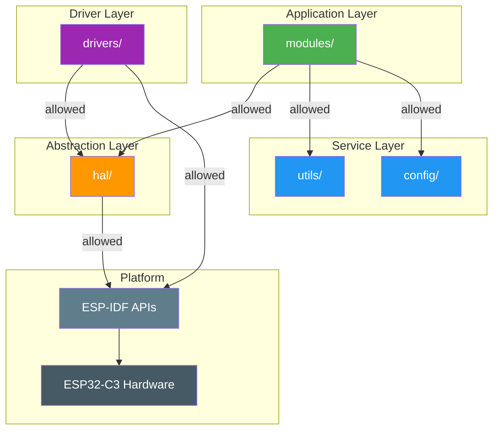
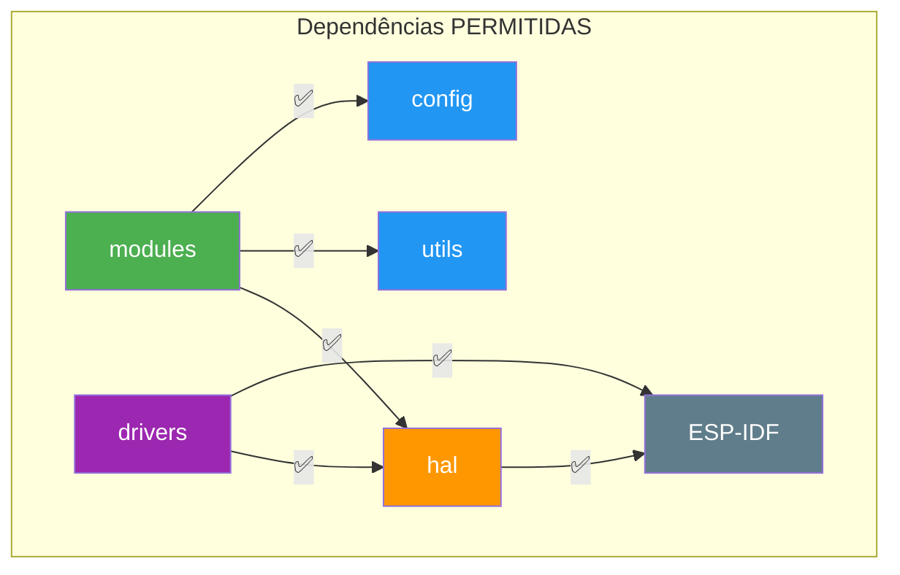
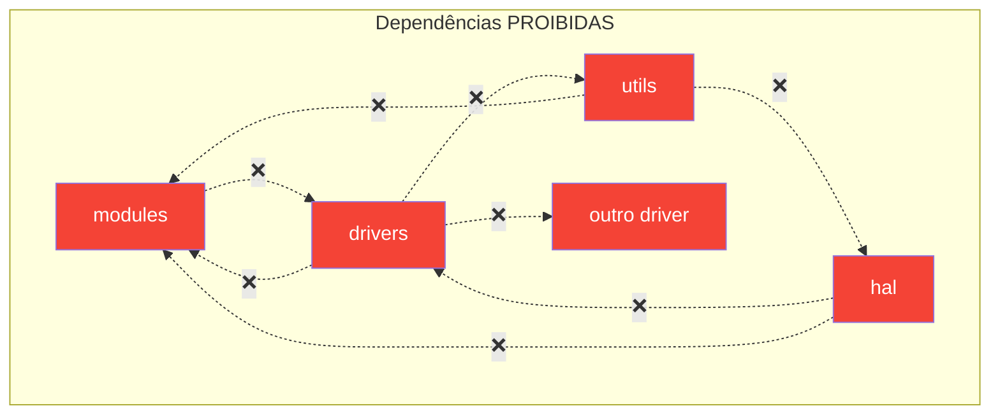
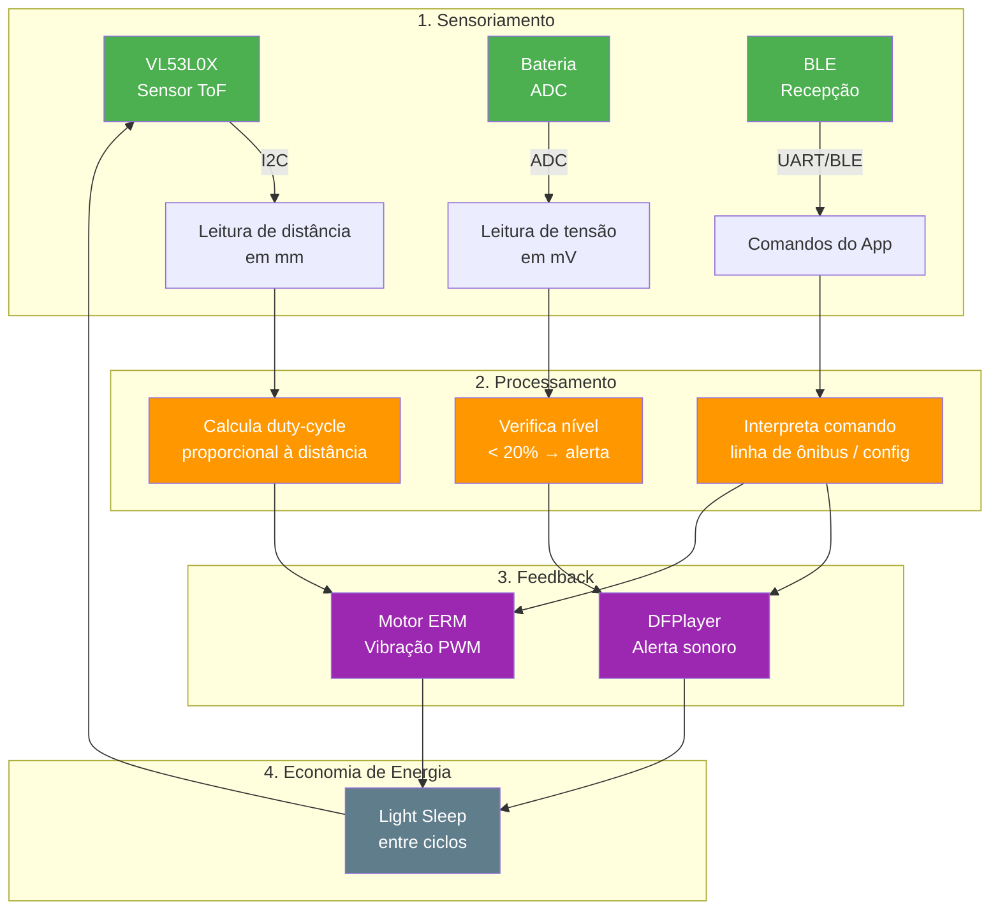
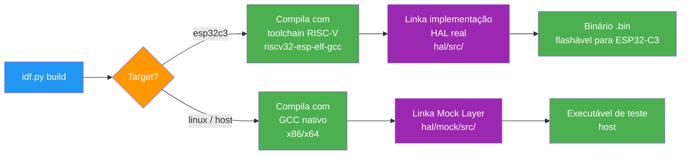
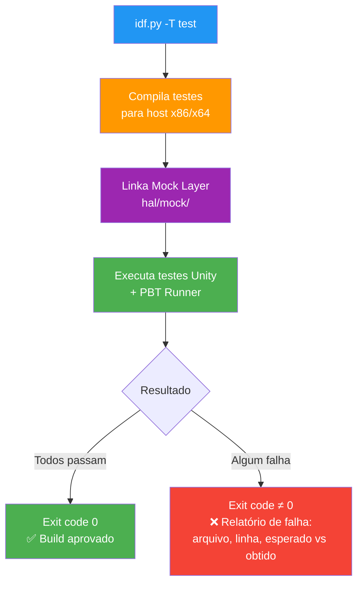

# Arquitetura do Firmware — Projeto Sóliton

Este documento descreve a arquitetura em camadas do firmware, as regras de dependência entre componentes, e os fluxos de dados, build e testes do projeto.

---

## Diagrama de Camadas

O firmware é organizado em camadas com responsabilidades bem definidas. Cada camada só pode depender das camadas abaixo dela, seguindo regras estritas.



---

## Regras de Dependência

### Dependências Permitidas (✅) e Proibidas (❌)

| Camada | Pode depender de | NÃO pode depender de |
|--------|-----------------|---------------------|
| **modules/** | `hal/`, `utils/`, `config/` | `drivers/` |
| **drivers/** | `hal/`, ESP-IDF APIs | `modules/`, `utils/`, outros `drivers/` |
| **hal/** | tipos C stdlib, ESP-IDF tipos | `drivers/`, `modules/` |
| **utils/** | tipos C stdlib | `hal/`, `drivers/`, `modules/` |
| **config/** | tipos C stdlib | tudo (contém apenas dados/constantes) |

### Diagrama de Dependências Permitidas vs Proibidas





---

## Fluxo de Dados do Firmware

O loop principal do firmware segue um ciclo contínuo de sensoriamento, processamento e feedback:



---

## Fluxo de Build

O sistema de build suporta dois targets: ESP32-C3 (hardware real) e Host (testes em x86/x64).



### Seleção de Implementação HAL

A flag de compilação `SOLITON_USE_MOCK` controla qual implementação da HAL é linkada:

| Flag | Implementação | Target | Uso |
|------|--------------|--------|-----|
| `SOLITON_USE_MOCK=0` (padrão) | `hal/src/` (real) | ESP32-C3 | Firmware de produção |
| `SOLITON_USE_MOCK=1` | `hal/mock/src/` | Host (x86/x64) | Testes unitários |

---

## Fluxo de Testes



### Tipos de Teste

| Tipo | Framework | Objetivo | Iterações |
|------|-----------|----------|-----------|
| **Unit Tests** | Unity + CMock | Exemplos específicos e edge cases | 1 por caso |
| **Property-Based Tests** | Unity + PBT Runner (C) | Propriedades universais com inputs aleatórios | 100 por propriedade |

---

## Estrutura de Diretórios

```
soliton/
├── CMakeLists.txt              # Root CMake (project())
├── sdkconfig.defaults          # Configuração base ESP32-C3
├── .clang-format               # Formatação automática
├── .clang-tidy                 # Análise estática
├── .github/workflows/ci.yml    # Pipeline CI
├── components/
│   ├── hal/                    # Camada de Abstração de Hardware
│   │   ├── include/            # Interfaces (hal_i2c.h, hal_pwm.h, etc.)
│   │   ├── src/                # Implementação real (ESP32-C3)
│   │   └── mock/              # Mock Layer para testes em host
│   ├── drivers/                # Drivers de periféricos
│   │   ├── vl53l0x/           # Sensor ToF (I2C)
│   │   ├── dfplayer/          # Módulo de áudio (UART)
│   │   ├── motor_erm/         # Motor de vibração (PWM)
│   │   └── battery/           # Leitura de bateria (ADC)
│   ├── modules/               # Lógica de aplicação (futuro)
│   ├── config/                # Constantes, pinout, thresholds
│   └── utils/                 # Utilitários compartilhados
├── main/                       # Ponto de entrada (app_main)
├── test/                       # Testes unitários e PBT
│   ├── hal/                   # Testes da HAL e Mock Layer
│   ├── drivers/               # Testes dos drivers
│   ├── modules/               # Testes dos módulos
│   ├── utils/                 # Testes de utilitários e PBT runner
│   └── build/                 # Testes de validação de camadas (CMake)
├── docs/                       # Documentação técnica
├── tools/                      # Scripts e templates
│   ├── setup.sh               # Setup do ambiente (Linux/macOS)
│   ├── setup.ps1              # Setup do ambiente (Windows)
│   ├── check_layers.cmake     # Validação de dependências entre camadas
│   └── templates/             # Templates para novos componentes
└── hardware/                   # Esquemáticos, PCB, Wokwi
    └── wokwi/diagram.json     # Configuração do emulador
```

---

## Aplicação das Regras de Camada (Build-Time)

As regras de dependência são aplicadas automaticamente em tempo de compilação pelo script CMake `tools/check_layers.cmake`. Qualquer violação interrompe o build com `FATAL_ERROR`:

```
LAYER VIOLATION: <componente_origem> (<camada>) cannot depend on <componente_destino> (<camada_proibida>)
```

Componentes sem `COMPONENT_LAYER` declarado no `CMakeLists.txt` também são rejeitados:

```
LAYER ERROR: <componente> does not have COMPONENT_LAYER defined
```
